# CSS 切版練習

## 001 圖文滿版

## 002 圖文互動

## 003 人員介紹
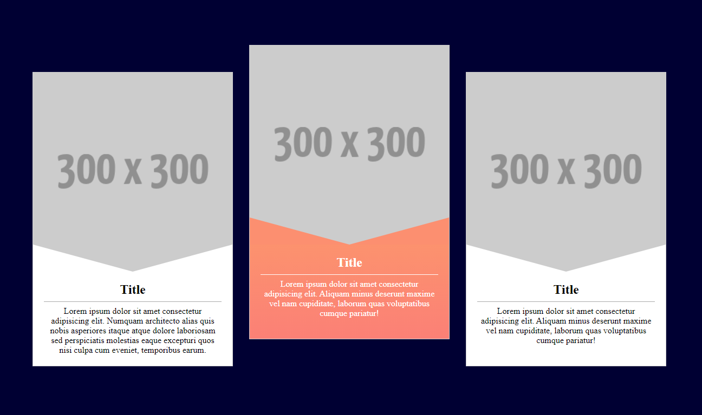

## 004 交錯漂浮

## 005 橫式版面
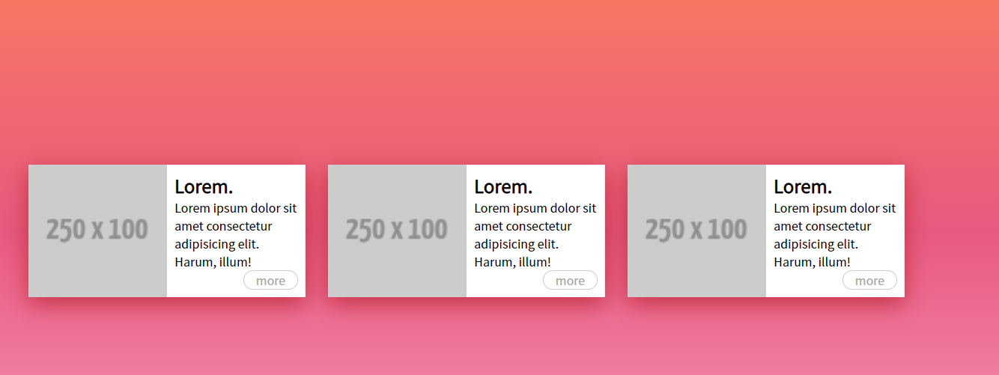

## 006 頁尾區域

## 007 導覽列
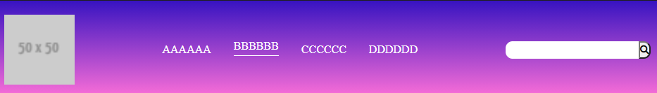

## 008 導覽列變化

## 009 麵包屑

## 010 方塊版面
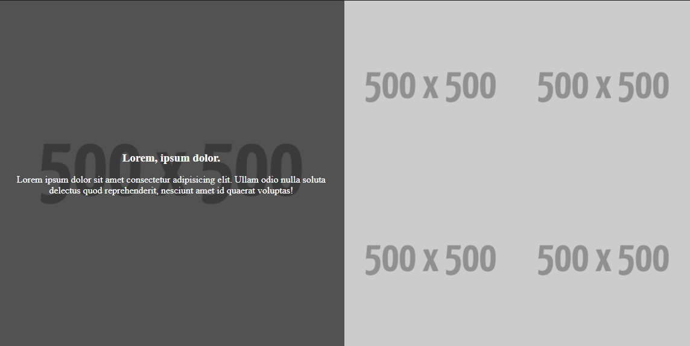

## 011 破格式
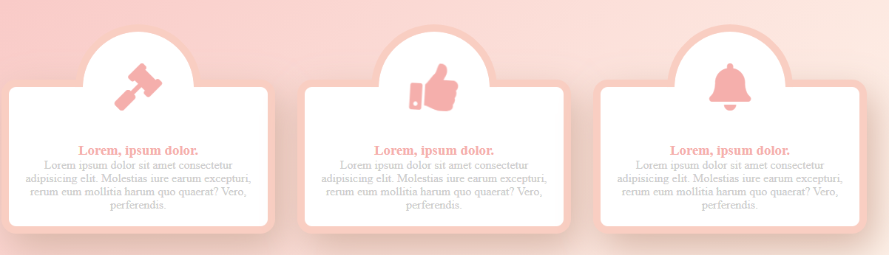

## 012 表格
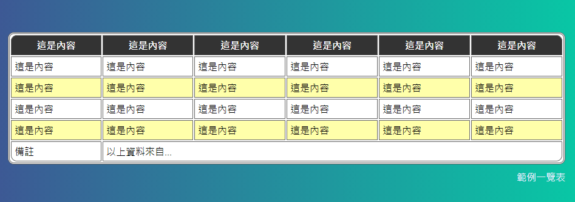

## 013 側邊選單
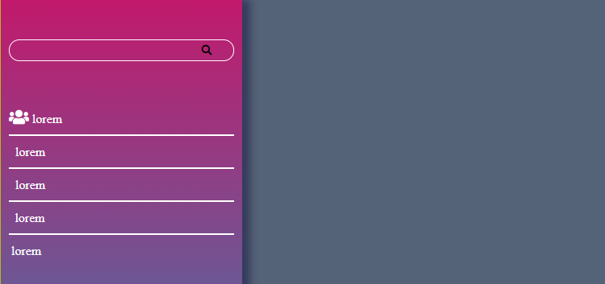

## 014 動態收合側邊選單
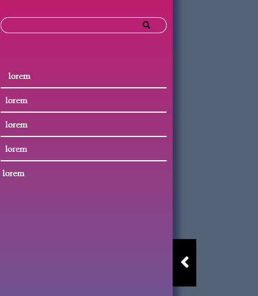

## 015 多層側邊選單
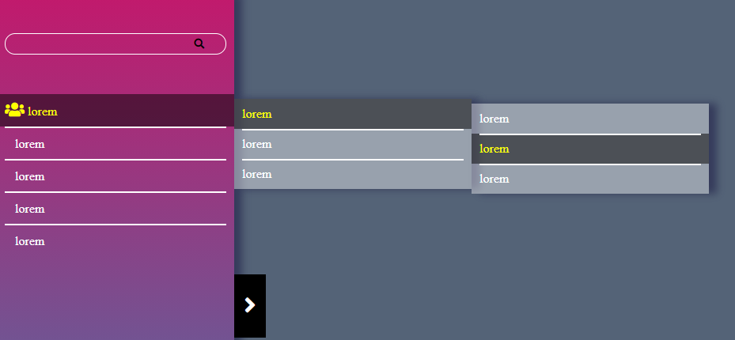

## 016 訂單進度條

## 017 表單登入
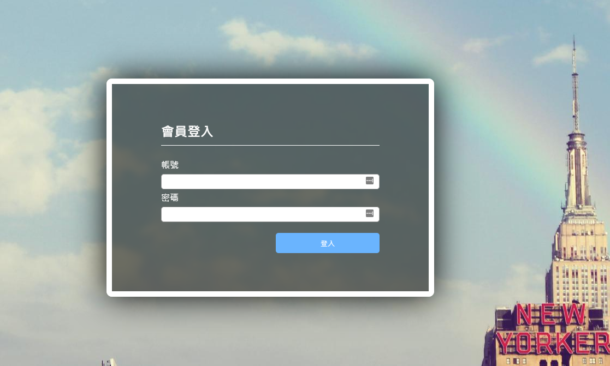

## 018 訊息對話

## 019 時間軸
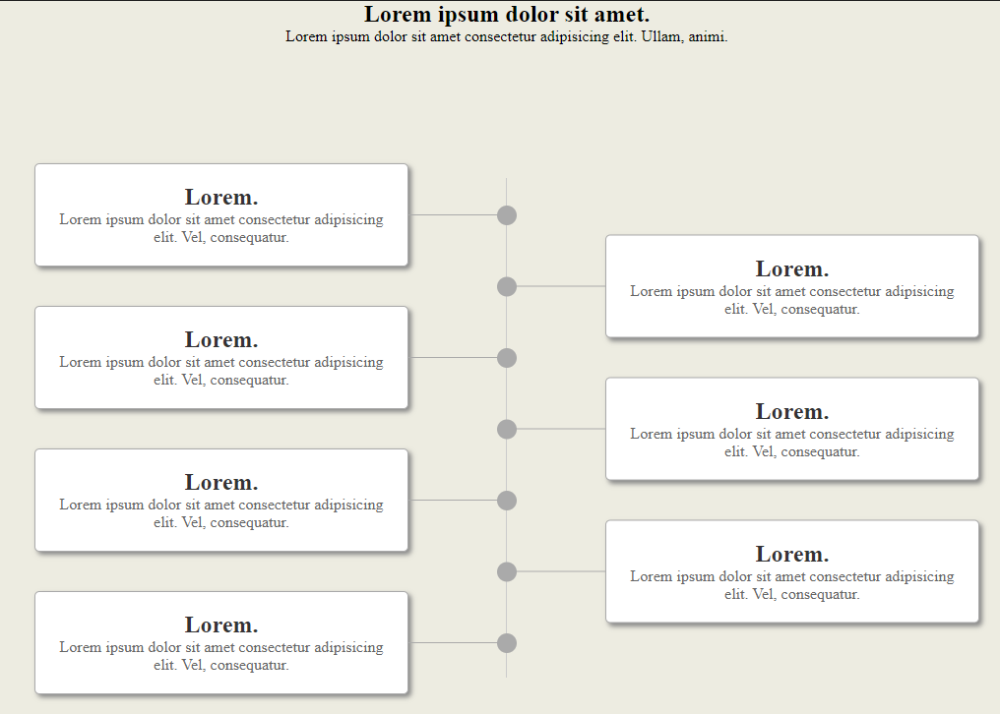

## 020 旋轉拼接
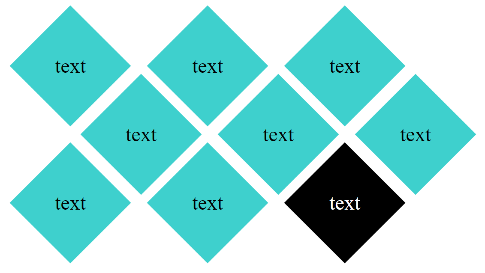

## 021 雲朵造型
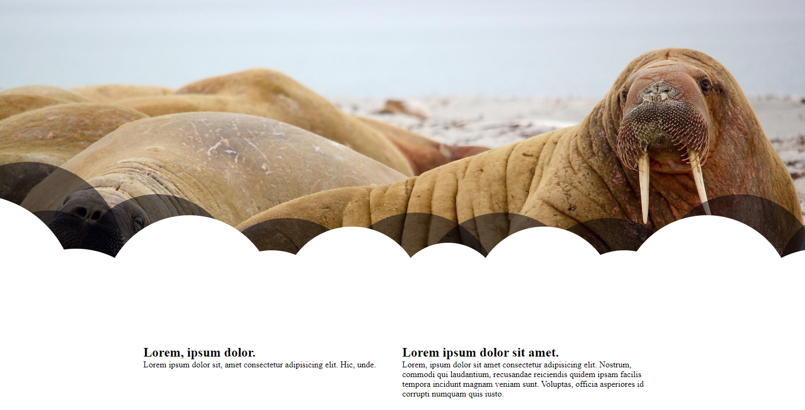

## 022 文字排版-1
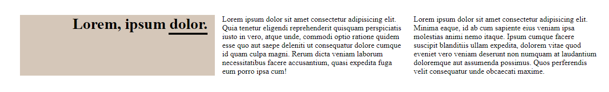
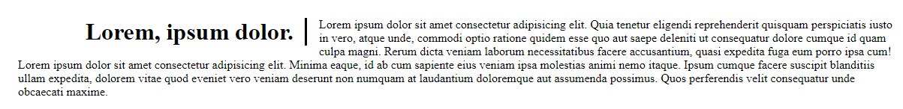
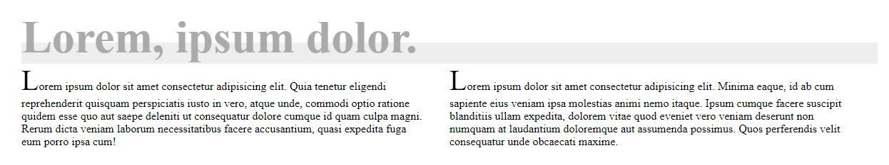

## 023 文字排版-2
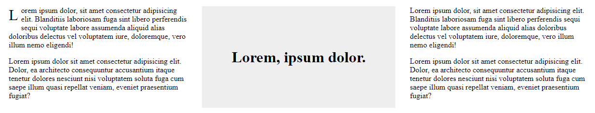
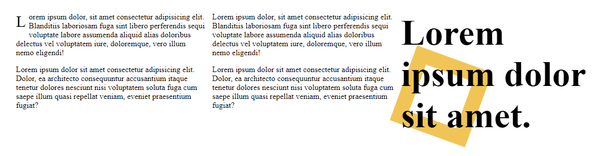

## 024 文字排版-3
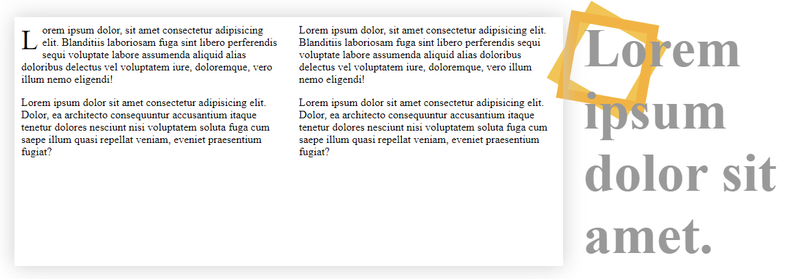
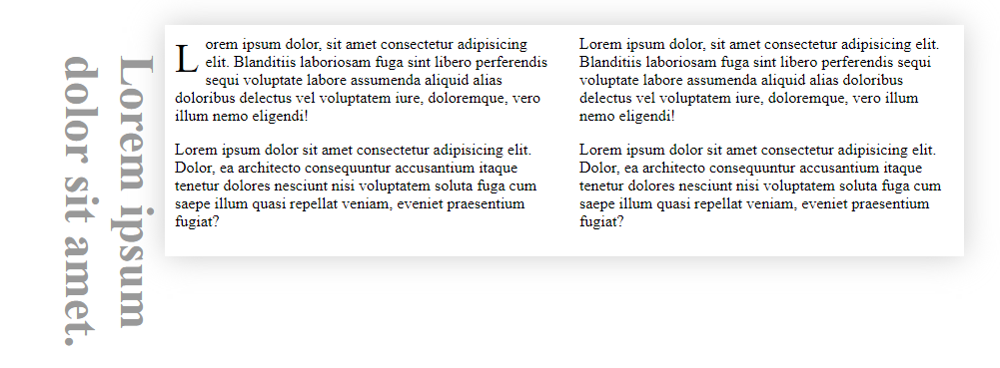
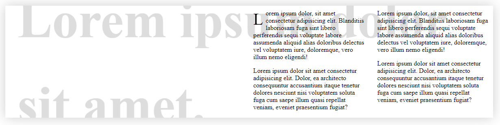

## 025 文字排版-4
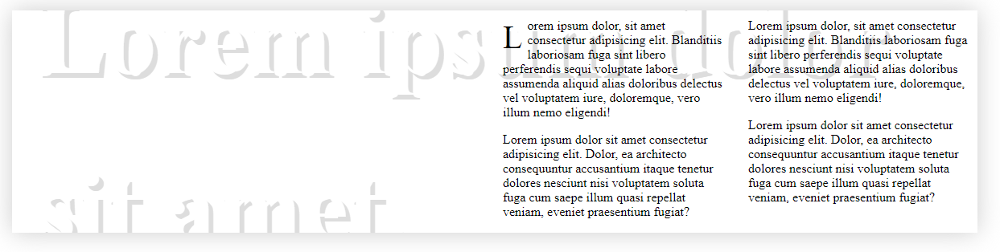
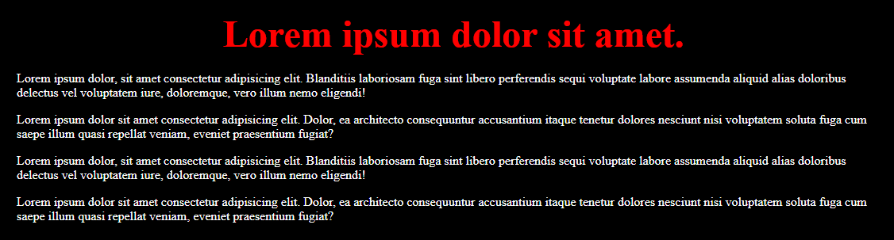
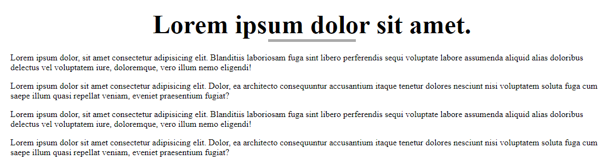
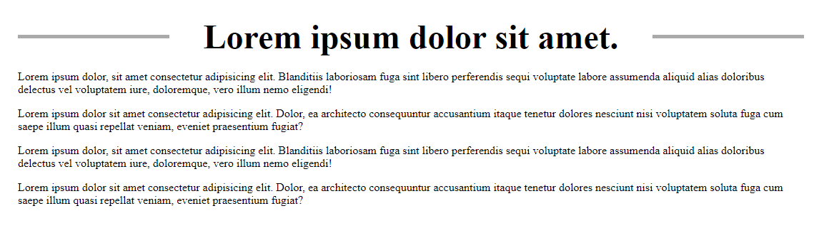
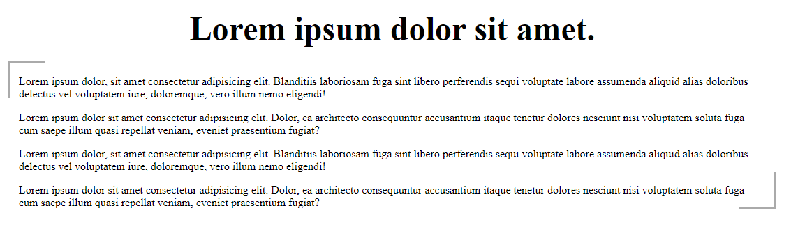