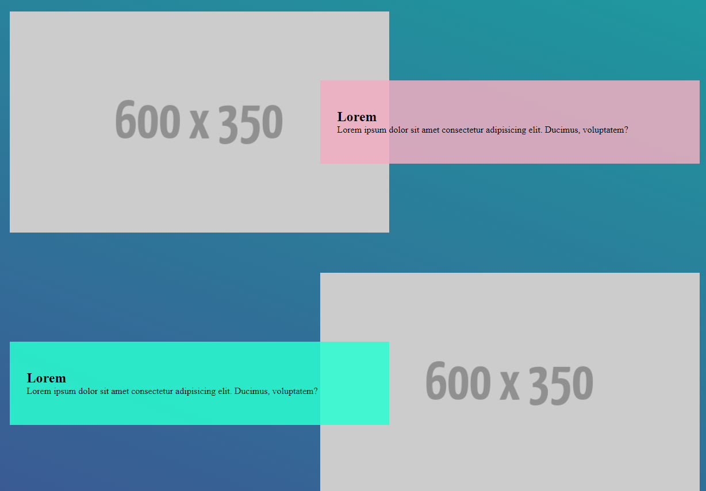
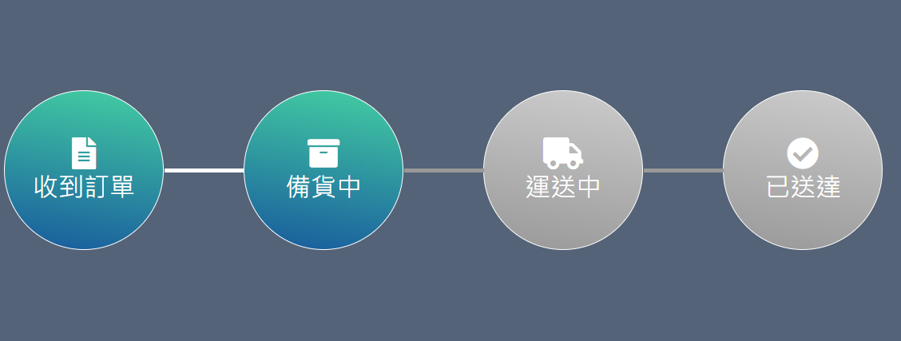

# CSS 切版練習

## 001 圖文滿版

## 002 圖文互動

## 003 人員介紹

## 004 交錯漂浮

## 005 橫式版面

## 006 頁尾區域

## 007 導覽列

## 008 導覽列變化

## 009 麵包屑

## 010 方塊版面

## 011 破格式

## 012 表格

## 013 側邊選單

## 014 動態收合側邊選單

## 015 多層側邊選單

## 016 訂單進度條

## 017 表單登入

## 018 訊息對話

## 019 時間軸

## 020 旋轉拼接
